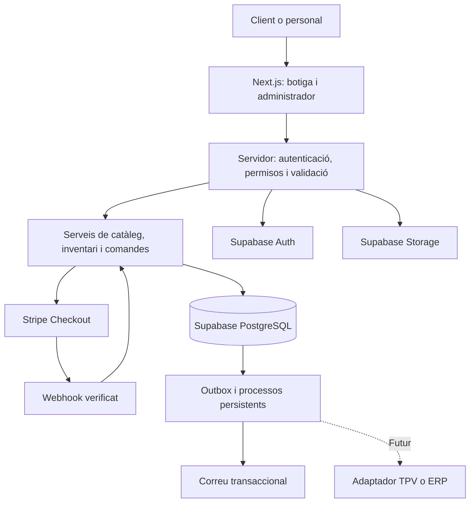

# Stack, arquitectura, infraestructura i seguretat

Data: 3 de setembre de 2026. Estat: arquitectura proposada per implementar, no auditoria d'una aplicació existent.

Document de producte: [Guia funcional de la PWA](01-guia-producte-pwa.md).

## 1. Decisions base

| Peça              | Elecció                              | Responsabilitat                                    |
| ----------------- | ------------------------------------ | -------------------------------------------------- |
| Aplicació         | Next.js App Router                   | Web pública, administrador i endpoints de servidor |
| Llenguatge        | TypeScript estricte                  | Contractes, models i validacions de tipus          |
| Estils            | Tailwind CSS                         | Sistema visual adaptable i consistent              |
| Dades             | PostgreSQL a Supabase                | Catàleg, estoc, comandes i auditoria               |
| Identitat         | Supabase Auth                        | Accés, verificació i recuperació de comptes        |
| Fitxers           | Supabase Storage                     | Fotografies i documents amb permisos diferenciats  |
| Desplegament      | Vercel                               | Execució de Next.js i distribució de recursos      |
| Pagament proposat | Stripe Checkout allotjat             | Recollida del pagament i notificacions al servidor |
| Correu            | Proveïdor transaccional per escollir | Confirmacions, recuperació i seguiment             |

Versions estables compatibles verificades en iniciar la implementació, fixades al projecte amb lockfile. No deixar dependències crítiques a versions flotants ni assumir que les API no canvien.

Supabase aporta PostgreSQL, Auth i Storage; el motor comercial és codi propi. Referència: [arquitectura de Supabase](https://supabase.com/docs/guides/getting-started/architecture).

## 2. Arquitectura modular

Un repositori i una aplicació modular. No començar amb microserveis. Els mòduls comercials no depenen de components React ni retornen objectes de proveïdors directament a la interfície.



Les operacions privilegiades passen pel servidor. Les consultes amb sessió fan servir el context de l'usuari i permisos adequats. Qualsevol accés directe del navegador a Supabase és explícit, mínim i protegit per polítiques.

### Estructura orientativa

```text
src/
  app/
    (store)/
    account/
    admin/
    api/webhooks/stripe/
  features/
    catalog/
    inventory/
    cart/
    checkout/
    orders/
    returns/
    customers/
    dashboard/
  components/ui/
  server/
    auth/
    permissions/
    services/
    repositories/
    integrations/stripe/
    integrations/supabase/
    integrations/email/
    jobs/
  lib/validation/
  types/
supabase/
  migrations/
  tests/
tests/
  integration/
  e2e/
public/
docs/
```

Pàgines i endpoints coordinen operacions; els serveis contenen regles comercials; els repositoris encapsulen persistència. Evitar un fitxer d'utilitats gegant i abstraccions genèriques sense ús concret.

## 3. Models de dades

| Entitat                     | Regles principals                                                    |
| --------------------------- | -------------------------------------------------------------------- |
| profiles, addresses         | Vinculació a Auth; accés del propietari i personal autoritzat        |
| staff_permissions           | Administració només per vies privilegiades; no editable pel client   |
| products, categories        | Publicació explícita; esborranys privats                             |
| product_variants            | SKU únic i estable; talla, color, preu i moneda                      |
| inventory_levels            | Unitats físiques i reservades per variant i ubicació                 |
| stock_movements             | Entrades, vendes, ajustos i devolucions amb motiu i referència única |
| carts, cart_items           | Propietari o sessió opaca de convidat; el carret no reserva estoc    |
| orders, order_items         | Instantània d'articles, imports i adreça en comprar                  |
| stock_reservations          | Variant, quantitat, intent, caducitat i estat                        |
| payment_attempts            | Intent intern, identificadors Stripe únics i estat verificat         |
| shipments                   | Estat logístic i seguiment independents del pagament                 |
| returns, return_items       | Quantitats retornades limitades a les comprades elegibles            |
| refunds                     | Imports i identificadors únics; estat del proveïdor                  |
| webhook_events, outbox_jobs | Deducció de duplicats, reintents i processament durable              |
| audit_events                | Autor, acció, objecte, data i canvis sensibles depurats              |
| external_mappings           | Proveïdor, tipus i identificador extern per futures integracions     |

- Diners en unitats menors enteres, amb moneda explícita; cap càlcul monetari amb floats.
- Dates persistides en UTC i presentades segons la zona del negoci.
- Claus foranes, restriccions de quantitat/import i índexs basats en consultes reals.
- Paginació obligatòria en catàleg, comandes, clients i registres.
- Separar camps públics de costos interns, notes i dades personals.
- Una comanda conserva el nom, SKU i preu comprats encara que el producte canviï.
- No esborrar en cascada historial comercial en eliminar un compte; definir anonimització i conservació.
- Estat de pagament, preparació, devolució i reemborsament separats amb transicions permeses.

## 4. Compra, concurrència i consistència

Aquest flux és una condició de llançament, no una optimització futura.

1. El navegador envia variants, quantitats i dades necessàries, sense poder fixar imports ni estats.
2. El servidor valida identitat o sessió de convidat, límits, productes publicats, preus, enviament i descomptes.
3. Una transacció PostgreSQL reserva totes les línies de forma atòmica i crea la comanda pendent i l'intent. Bloquejar files en ordre estable o fer actualitzacions condicionals equivalents.
4. El servidor crea la sessió Stripe amb clau d'idempotència estable per intent i desa la referència. La crida externa queda fora de la transacció SQL.
5. Si es perd la resposta de Stripe, recuperar l'intent amb la mateixa clau; no alliberar cegament una reserva si el resultat extern és desconegut.
6. El webhook verifica signatura sobre el cos original i concordança d'entorn, sessió, import i moneda.
7. Desar l'esdeveniment de forma durable. El processament confirma l'estat pagat i converteix la reserva en venda una sola vegada en una transacció.
8. Crear el correu a l'outbox en la mateixa transacció que confirma la comanda. Enviar-lo amb reintents fora de la petició de compra.
9. La pàgina de retorn consulta l'estat autoritzat. Mai marca pagat des d'un paràmetre de l'URL.

Stripe exigeix tractar notificacions repetides i confirmar els pagaments des del servidor. Referència: [Stripe — fulfillment](https://docs.stripe.com/checkout/fulfillment).

### Reserves i casos límit

- Objectiu: estoc disponible = físic − reservat, sense quantitats negatives.
- La durada de reserva ha de ser compatible amb la caducitat de Checkout. No fixar un TTL sense revisar les restriccions del proveïdor.
- Alliberar reserves només després de reconciliar que l'intent no s'ha pagat i ja no pot completar-se; coordinar expiració i webhook sobre el mateix estat bloquejat.
- Primera versió: habilitar només mètodes el cicle dels quals s'hagi implementat i provat. Els pagaments diferits necessiten tractament específic de l'estat pendent.
- Un pagament tardà inesperat queda en revisió i genera alerta; no provocar sobreventa ni enviament automàtic.
- Duplicar un event ID no duplica feina; dos events diferents del mateix pagament tampoc han de duplicar la venda.
- Reconciliació periòdica de pagaments pendents, reserves, reemborsaments i errors persistents.
- Reemborsar amb idempotència, límit sobre l'import pendent de retornar i verificació d'estat. Reposar estoc només després d'inspecció i una sola vegada.

## 5. Seguretat de dades i permisos

### Supabase

- RLS activada a totes les taules d'esquemes exposats; permisos SQL mínims i explícits.
- Les polítiques han de comprovar propietat i operació; estar autenticat no dona accés a tots els clients.
- En actualitzacions, revisar fila accessible i estat resultant. No permetre canviar propietari, rol, preu final o estat de pagament des d'un formulari de client.
- La lectura d'una comanda no concedeix permís per modificar-ne els imports.
- Provar vistes, funcions i Storage com a superfícies d'accés pròpies; no assumir que hereten la protecció correcta.
- Preferir funcions invocadores; qualsevol funció privilegiada requereix permisos d'execució restringits, noms qualificats, search_path controlat i autorització explícita.

Referència: [Supabase — RLS](https://supabase.com/docs/guides/database/postgres/row-level-security).

### Identitat i secrets

- Supabase Auth gestiona les credencials. No construir un sistema propi de contrasenyes.
- Verificar identitat al servidor amb el mecanisme vigent de l'SDK; no confiar en dades de sessió aportades pel navegador.
- MFA obligatori per al personal i reautenticació per a canvis de permisos i operacions especialment sensibles.
- Rols en dades controlades pel servidor; mai en metadades que l'usuari pugui editar. Preveure revocació efectiva de permisos encara que existeixi un token anterior.
- Convidats amb identificador opac no predictible. Consulta de comanda després de verificació, amb expiració i límits d'intents.
- Configurar cookies i flux SSR segons l'SDK: Secure, SameSite adequat i HttpOnly quan el model ho permet; documentar qualsevol token accessible a JavaScript.
- Claus secretes Supabase i Stripe exclusivament al servidor. Les claus privilegiades poden evitar RLS: no usar-les com a client universal de totes les peticions.
- Només URL i clau publicable de Supabase poden ser públiques quan calgui; la clau publicable no substitueix els permisos.
- Cap secret a NEXT_PUBLIC_, Git, captures, errors o logs. Fitxer d'exemple només amb noms i valors ficticis.

### Aplicació

- Validació d'esquemes al servidor amb llistes explícites de camps; TypeScript no valida una petició externa.
- Autoritzar cada Server Action i endpoint; el middleware/proxy no és l'única barrera.
- Consultes parametritzades, HTML no fiable sanejat i evitar execució de contingut aportat per l'usuari.
- Protecció CSRF per mutacions basades en cookies, validació d'origen i cap mutació amb GET. Els webhooks s'autentiquen amb signatura.
- Límits distribuïts de peticions i mida a login, recuperació, cerca, checkout, invitacions i càrregues; no només comptadors en memòria de la funció.
- CSP, protecció d'emmarcat, política de referència i capçaleres ajustades als dominis necessaris i provades amb Checkout.
- Destinacions de redirecció en llista permesa; evitar open redirects. Descàrregues remotes restringides per prevenir SSRF.
- Carregar només fitxers autoritzats amb mida i tipus comprovats. Reprocessar imatges, eliminar metadades i rebutjar contingut actiu no necessari.
- Fotos publicades en espai públic; documents de clients en espai privat amb accés temporal autoritzat.
- Errors públics sense traces internes; logs amb identificadors de correlació i sense contrasenyes, tokens o dades de targeta.

Referències: [Next.js — seguretat de dades](https://nextjs.org/docs/app/guides/data-security), [OWASP — autorització](https://cheatsheetseries.owasp.org/cheatsheets/Authorization_Cheat_Sheet.html).

## 6. Memòria cau i PWA

| Contingut                        | Política proposada                                      |
| -------------------------------- | ------------------------------------------------------- |
| Recursos estàtics versionats     | Memòria cau llarga amb canvi de versió                  |
| Catàleg públic                   | Memòria cau controlada i invalidació en editar          |
| Estoc al moment de comprar       | Validació transaccional contra la base de dades         |
| Compte, comandes i administrador | Sense memòria cau compartida; resposta privada/no-store |
| Checkout, auth i webhooks        | Sense memòria cau al service worker                     |

Separar resposta pública de qualsevol dada personalitzada. No emmagatzemar dades de clients a CDN ni incloure-les en generació estàtica. Fer servir una llista explícita de recursos cachejables al service worker, purgar versions antigues i retirar dades locals de sessió en sortir. El carret de convidat només conté referències i quantitats.

## 7. Infraestructura i operació

- Entorns separats: desenvolupament, proves i producció, amb bases de dades, claus Stripe i secrets independents.
- Previews amb dades fictícies i accés restringit quan pertoqui; mai claus ni còpies de clients de producció.
- Vercel i Supabase en regions properes; revisar regió de dades, subprocessadors i necessitats del negoci abans de crear producció.
- Vercel per executar Next.js; dades persistents a Supabase. No dependre del disc local o la memòria d'una funció per conservar feina.
- Treballs persistents amb estat a PostgreSQL, bloqueig de treballadors, reintents amb espera progressiva, límit d'intents i cua d'errors revisable.
- El planificador ha de tenir autenticació, tolerar execucions duplicades i respectar la durada màxima del runtime. Escollir-ne la implementació en la fase tècnica.
- Pool de connexions adequat si s'accedeix directament a PostgreSQL; evitar obrir connexions il·limitades per petició.
- Domini propi, HTTPS, DNS documentat i correu amb configuració d'autenticació del domini.
- Comptes de producció propietat del negoci, accessos individuals i MFA; baixa d'accessos quan una persona deixa el projecte.

### Costos

Pressupostar Vercel, Supabase, Stripe, domini, correu, observabilitat, còpies i transferència de fitxers. Activar avisos de consum i revisar límits abans del llançament. No pressupostar una botiga comercial sobre Vercel Hobby: el pla està destinat a ús personal no comercial. Referència: [Vercel Hobby](https://vercel.com/docs/plans/hobby).

No es fixa cap tarifa en aquesta guia. Confirmar plans vigents, volum i impostos en contractar; pagar un pla no substitueix l'optimització ni el manteniment.

### Còpies, monitoratge i incidents

- Definir RPO i RTO amb el negoci abans de producció. Proposta a validar: perdre com a màxim 1 hora de dades i recuperar el servei en 4 hores; contractar i provar els mecanismes necessaris per assolir-ho.
- Còpies de PostgreSQL i de fitxers Storage per separat; verificar què cobreix realment el pla.
- Restaurar en un entorn aïllat abans del llançament i periòdicament. Després d'una restauració, reconciliar amb Stripe abans de reprendre enviaments.
- Alertes de checkout fallit, webhook endarrerit, reserves encallades, errors de reemborsament, correus fallits i consum anormal.
- Auditoria de canvis d'estoc, permisos i reemborsaments amb escriptura restringida i retenció definida.
- Responsable i procediment d'incidents: contenir, revocar o rotar secrets, preservar evidències, recuperar i revisar causa. Les comunicacions depenen de l'impacte i les obligacions aplicables.

## 8. Integracions futures

Supabase és inicialment la font autoritativa de catàleg, estoc i comandes. Stripe és la referència externa de l'estat del cobrament, reconciliada amb els registres locals.

Definir interfícies petites per inventari, pagaments i sincronització. No passar objectes específics de Stripe o Supabase als components de producte.

Quan es conegui el TPV/ERP:

1. Verificar API, connector, autenticació, límits i qualitat de dades.
2. Acordar quin sistema governa cada camp i evitar dos sistemes escrivint estoc sense coordinació.
3. Mapar SKU i identificadors externs; no usar el nom del producte com a clau.
4. Implementar sincronització idempotent amb registre d'errors i reconciliació.
5. Provar vendes online i presencials concurrents i establir què passa quan es perd la connexió.

La separació facilita integrar serveis, però no garanteix compatibilitat amb qualsevol programa ni una migració sense cost.

## 9. Desenvolupament i desplegaments

- TypeScript estricte, format consistent, lint i separació clara entre codi de servidor i navegador.
- Components de servidor per defecte; components de client només per interactivitat necessària.
- Canvis de base de dades versionats i reproduïbles, incloent permisos i polítiques. Mai desactivar RLS per resoldre un error d'accés.
- Generar migracions amb les eines vigents després de validar els canvis en desenvolupament; no experimentar sobre producció.
- Canvis compatibles en fases: ampliar esquema, desplegar codi, migrar dades i retirar camps antics posteriorment.
- CI amb tipus, lint, build, proves de negoci/permisos, cerca de secrets i revisió de dependències.
- Cap desplegament amb errors de build o vulnerabilitats crítiques conegudes sense resolució. Revisar també vulnerabilitats altes segons exposició abans de publicar.
- Revisió de canvis sensibles i actualització regular de dependències; proves de regressió després de canvis d'Auth, pagaments o permisos.
- Rollback d'aplicació preparat. Una reversió de codi no desfà automàticament una migració de dades.

## 10. Proves obligatòries i evidència

| Risc                   | Prova exigida                                                                  |
| ---------------------- | ------------------------------------------------------------------------------ |
| Accés entre clients    | Client A no llegeix ni modifica comandes, adreces o fitxers de B via UI o API  |
| Escalada de privilegis | Un client no pot alterar rols ni invocar operacions de personal                |
| Sobreventa             | Dos checkouts sobre una unitat; només una reserva vàlida                       |
| Manipulació            | Quantitats negatives, preus falsos i camps extra rebutjats                     |
| Webhooks               | Signatura invàlida, duplicats, ordre alterat i reintent després de fallada     |
| Caiguda parcial        | Stripe respon però falla el guardat local; reconciliació sense doble cobrament |
| Caducitat              | Expiració i pagament simultanis sense alliberament incorrecte                  |
| Devolucions            | Reemborsament parcial repetit i reposició repetida no dupliquen efectes        |
| Fuita per caché        | Canvi d'usuari i offline sense dades del compte anterior                       |
| Secrets                | Inspecció del bundle, repositori i logs sense credencials privilegiades        |
| Recuperació            | Restauració de dades i fitxers amb reconciliació de comandes                   |

Guardar evidència del resultat i versió provada. Les eines automàtiques complementen la revisió manual; passar un escàner no certifica absència de vulnerabilitats.

## 11. Condicions per publicar

- [ ] Flux de compra i postvenda acceptat pel negoci.
- [ ] Permisos, RLS, Storage i proves entre usuaris aprovats.
- [ ] Concurrència, idempotència i reconciliació verificades.
- [ ] Entorns, dominis, correus i secrets separats.
- [ ] Còpies restaurades i objectius de recuperació acordats.
- [ ] Monitoratge, alertes i responsable d'incidents assignats.
- [ ] Costos i plans comercials revisats.
- [ ] Política de dades i condicions comercials validades.
- [ ] Sense defectes crítics oberts de compra, seguretat o integritat de dades.

## 12. Documentació de referència

Consultar les versions vigents abans d'implementar:

- [Next.js a Vercel](https://vercel.com/docs/frameworks/full-stack/nextjs)
- [Supabase: canvis de plataforma](https://supabase.com/changelog)
- [Supabase: seguretat de la Data API](https://supabase.com/docs/guides/api/securing-your-api)
- [Supabase: seguretat del producte](https://supabase.com/docs/guides/security/product-security)
- [Stripe Checkout](https://docs.stripe.com/payments/checkout)

Les decisions d'aquesta guia són requisits del projecte; els enllaços documenten les capacitats i precaucions dels proveïdors, no certifiquen la nostra futura implementació.
